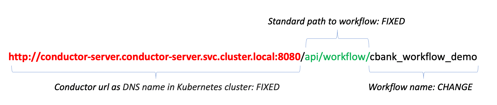

# Netflix Conductor Workflow example, integrated with Parse

## Introduction

In this lab we will see how to start a workflow created with [Netflix Conductor](https://conductor.netflix.com/) to manage a bank transfer from the mobile app developed in [Flutter](https://flutter.dev), by starting the process directly from the Parse platform following the creation of an object containing the related information.
We will see how it is possible to integrate the Workflow and Parse engine with a simple configuration to simplify the development of a complex banking process that uses the Flutter mobile app which uses, thanks to the SDK, the Parse platform as a Mobile Backend to record application data on to initiate processes.

[Oracle Backend as a Service for Spring Cloud](https://oracle.github.io/microservices-datadriven/spring/) includes the [Netflix Conductor Server](https://conductor.netflix.com/). Conductor is a popular workflow solution that works with Spring Boot microservices and Oracle Database.
Within the Parse Platform, there exists a method for initiating a REST call to a designated service, known as Webhooks. This functionality permits you to craft your server-side logic within an environment of your choosing, utilizing whichever tools you deem appropriate. In this specific scenario, the chosen "tool" happens to be the Netflix Conductor platform. This approach circumvents the necessity of embedding any form of "Cloud Code" within the Parse Platform, which could potentially give rise to security vulnerabilities. The Webhooks feature is currently accessible for events such as **beforeSave**, **afterSave**, **beforeDelete** and **afterDelete** in relation to Parse Objects. To establish a new webhook, the Parse Dashboard proves instrumental, as it offers a dedicated section for Webhooks within the Core settings.

This is the architecture behind this demo, that explain how to integrate Parse platform, Spring Boot apps and Netflix Conductor, it’s shown in the following picture:


Defining a Webhook on the afterSave() event linked to the CloudCashPayment class, it will be started a Netflix Conductor workflow addressed by the Webhook in the Parse Platform.
We will show the end-to-end flow.

Estimated Time: 20 minutes


### Objectives

In this lab, you will:
* Create a Netflix Conductor Workflow
* Link with a Webhook the creation of new Transfer object to the Workflow to start it.

### Prerequisites

This lab assumes you have:
* An Oracle Cloud account
* All previous labs successfully completed
* Completed the optional **Install Flutter** task in the **Setup your Development Environment** lab

## Task 1: Develop and deploy the Netflix Conductor workflow

This is an high level description about the workflow that has been developed as demo that you can download [here]() and installed in the engine available in the Oracle Backend for Spring Boot:

Start with: CloudCashPayment.afterSave() holding: {"amount": number, "fromAccount": "cdebari", "destination": "andy@test.com"}
- TASK **call\_customer\_service**:
      * Call API:  /api/v1/customer/customer/byemail/{email} 
      * IN: Start.destination
      * OUT: customerId 
- TASK **call\_account\_service**:
      * Call API: /api/v1/account/getAccounts/{customerId}
      * IN: call\_customer\_service.customerId
      * OUT: accountId 
- TASK **call\_transfer\_service**:
      * Call API: /transfer?fromAccount=x&toAccount=x&amount-x API
      * IN: 
         * fromAccount=Start.fromAccount
         * toAccount=call\_account\_service.accountId
         * amount=Start.amount
      * OUT: start the transfer saga, get EXIT_CODE
- End with EXIT_CODE


   ...

    ```shell
    $ <copy>git clone https://github.com/oracle/microservices-datadriven.git</copy>
    ```

   The source code for the CloudBank application will be in the `microservices-datadriven` directory you just created, in the `cloudbank-v2/flutter-app` subdirectory.

    ```shell
    $ <copy>cd microservices-datadriven/cloudbank-v2/flutter-app</copy>
    
    ```
## Task 2: Link the Workflow to a new CloudCashPayment

1. Access to the Parse Dashboard, as describe previously in **Lab. 1 - Task 2**:

You should find the Object class "CloudCashPayment" created in the mobile app development:


2. Now we have to create a Webhooks to trigger a call after a new **CloudCashPayment** object it's saved by the mobile client:


   Click the menu item and fill the dialog box choosing "afterSave" event as a Webhook type:


   Then choose the Class "CloudCashPayment" in the list:


   and finally insert the internal Kubernetes url for Conductor server plus the workflow path:
   ```shell
      <copy>http://conductor-server.conductor-server.svc.cluster.local:8080/api/workflow/cbank_workflow_demo</copy>
   ```

   that is composed from these parts:
   

   When you'll click on "Create" button, you will get this error:


   There is a bug in the DashBoard GUI: the Webhook is correctly created even if appears this message. Refreshing the page you'll see the Webhook created:


3. When it will be created a new "CloudCashPayment" object, it will be called the url specified in Webhook that will start the workflow. The payload of message is like this:
```json
Body: {
   "triggerName": "afterSave",
   "object": {
      "amount": 1000,
      "destination": andy@test.com,
      "fromAccount": "cdebari",
      "createdAt": "2023-06-20T15:48:41.730Z",
      "updatedAt": "2023-06-20T15:48:41.730Z",
      "objectId": "yH8iuP59Ct",
      "className": "CloudCashPayment"
   },
   "master": true,
   "log": {
      "options": {
      "jsonLogs": false,s
      "logsFolder": "./logs",
      "verbose": false
      },
      "appId": "69uBOlaFBWds1KlMpcvSy5sPxsGNF0RXnkLqiO09"
   },
   "headers": {
      "host": "129.213.192.16",
      "x-request-id": "8d5d8a49ea6f7f842499f41865278fa1",
      "x-real-ip": "10.74.2.60",
      "x-forwarded-for": "10.74.2.60",
      "x-forwarded-host": "129.213.192.16",
      "x-forwarded-port": "80",
      "x-forwarded-proto": "http",
      "x-forwarded-scheme": "http",
      "x-scheme": "http",
      "x-original-forwarded-for": "85.146.237.253",
      "content-length": "342",
      "user-agent": "Mozilla/5.0 (Macintosh; Intel Mac OS X 10_15_7) AppleWebKit/537.36 (KHTML, like Gecko) Chrome/108.0.0.0 Safari/537.36",
      "content-type": "text/plain",
      "accept": "*/*",
      "origin": http://obaas,
      "referer": http://obaas/,
      "accept-encoding": "gzip, deflate",
      "accept-language": "en,it;q=0.9"
   },
      "ip": "10.74.2.60",
      "context": {},
      "installationId": "b4bad867-de84-46ff-a531-b6c2e791ec83"
}
```

   The Conductor workflow must get from the "object" item the content of CloudCashPayment:

```json
...
"object": {
"amount": 1000,
"destination": andy@test.com,
"fromAccount": "cdebari",
"createdAt": "2023-06-20T15:48:41.730Z",
"updatedAt": "2023-06-20T15:48:41.730Z",
"objectId": "yH8iuP59Ct",
"className": "CloudCashPayment"
},
...
```

   and use the values to call the REST services exposed by SpringBoot CloudBank microservices.
   The cbank_workflow_demo.json will manage the request as shown in the initial part of code:

```json
  "name": "cbank_workflow_demo",
        "description": "Cloud Bank Demo Workflow",
        "version": 1,
        "inputParameters": [
            "object"
        ],
        "tasks": [
            {
                "name": "call_account_service",
                "taskReferenceName": "call_account_service_from",
                "type": "HTTP",
                "inputParameters": {
                    "http_request": {
                        "uri": "http://account.application.svc.cluster.local:8080/api/v1/account/getAccounts/${workflow.input.object.fromAccount}",
                        "method": "GET",
                        "connectionTimeOut": 3000,
                        "readTimeOut": 3000
                    }
                }
            },
...
```

   As you can see, the input parameters to receive the payload from Parse Webhook is a generic object:

```json
...
"inputParameters": [
            "object"
        ],
...
```

   and the application data related to the CloudCashPayment object will be available via **workflow.input.object.**, as shown in the first task call:
```json
"uri": "http://account.application.svc.cluster.local:8080/api/v1/account/getAccounts/${workflow.input.object.fromAccount}"
```

## Learn More

* [Netflix Conductor](https://conductor.netflix.com/)
* [Flutter](https://flutter.dev)
* [Parse Platform](https://parseplatform.org/)
* [Oracle Backend for Spring Boot](https://oracle.github.io/microservices-datadriven/spring/)
* [Oracle Backend for Parse Platform](https://oracle.github.io/microservices-datadriven/mbaas/)

## Acknowledgements

* **Author** - Doug Drechsel, Mark Nelson, Developer Evangelists, Oracle Database
* **Contributors** - [](var:contributors)
* **Last Updated By/Date** - Mark Nelson, March 2023
